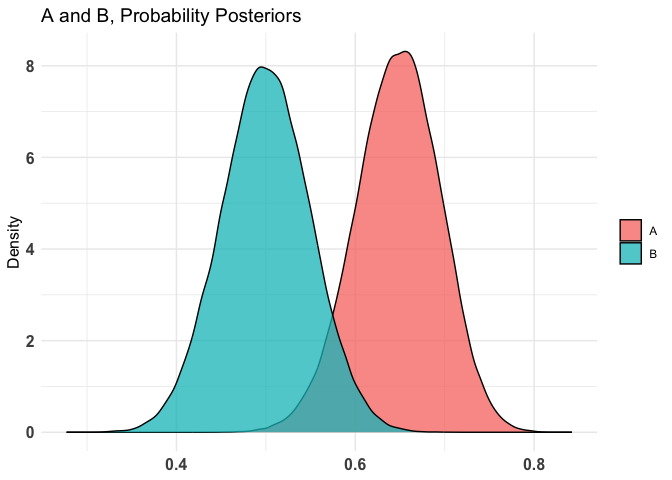
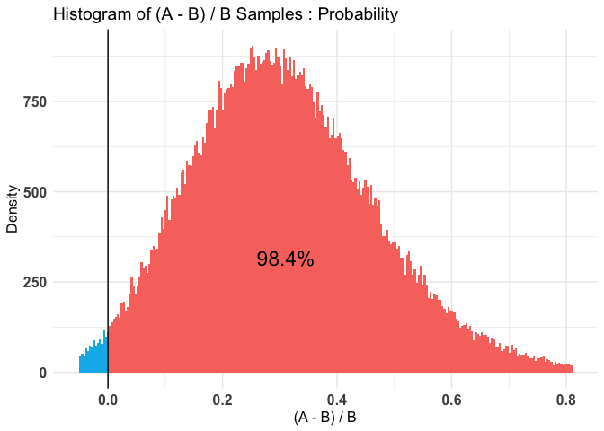

# Bayesian A/B Testing

> Source: Hoffmann, T., Hofman, A. D., & Wagenmakers, E. (2021, June
> 10). A Tutorial on Bayesian Inference for the A/B Test with R and
> JASP. https://doi.org/10.31234/osf.io/z64th

There are two approaches to Bayesian A/B testing.

1.  Independent Beta Estimation (IBE) Approach

2.  The Logit Transformation Testing (LTT) Approach

## Independent Beta Estimation (IBE) Approach

**Problem Statement:** We want to know whether honey bees have color
vision.

**Experiment Design:** The experiment involves a training and a testing
phase. In the training phase, the bees in the experimental condition are
presented with a blue and a green disc. Only the blue disc is covered
with a sugar lotion that bees crave. The control group receives no
training. In the testing phase, the sugar lotion is removed from the
blue disc, and the behavior of both groups is being observed. If the
bees in the experimental condition have learned that only the blue disc
contains the appetising sugar lotion, and if they can discriminate
between blue and green, they should preferentially explore the blue
instead of the green disc during the testing phase.

**Treatment Arms:** A: Treatment (i.e. received training), B: Control
(No training).

**Priors:** Two uninformative uniform priors, i.e. Beta(1, 1).

``` r
library(dplyr)
library(bayesAB)
library(HDInterval)
```

``` r
bees_01_df <- read.csv(here::here("data/bees_data1.csv"), sep = ";") %>% 
  select(bees_id = X, y1, y2)

head(bees_01_df)
```

      bees_id y1 y2
    1       1  1  1
    2       2  1  1
    3       3  0  0
    4       4  1  1
    5       5  0  0
    6       6  0  0

``` r
ab1 <- bayesTest(
  A_data = bees_01_df$y2, # new intervention
  B_data = bees_01_df$y1, # existing intervention
  priors = c('alpha' = 1, 'beta' = 1),
  n_samples = 1e+05,
  distribution = "bernoulli"
)
```

``` r
ab_sum <- summary(ab1)

ab_sum
```

    Quantiles of posteriors for A and B:

    $Probability
    $Probability$A
           0%       25%       50%       75%      100% 
    0.4400730 0.6159400 0.6484131 0.6798257 0.8423514 

    $Probability$B
           0%       25%       50%       75%      100% 
    0.2770962 0.4665621 0.4998731 0.5334639 0.7104011 


    --------------------------------------------

    P(A > B) by (0)%: 

    $Probability
    [1] 0.98379

    --------------------------------------------

    Credible Interval on (A - B) / B for interval length(s) (0.9) : 

    $Probability
            5%        95% 
    0.06012557 0.59611020 

    --------------------------------------------

    Posterior Expected Loss for choosing A over B:

    $Probability
    [1] 0.000755924

The following figure presents the independent posterior beta
distribution of the success probabilities for the group A & B.

``` r
plot(ab1)$posteriors
```

    $Probability



We can see that the group A’s posterior distribution assigns more mass
to higher values of $\theta$. This suggest that the trained bees has
higher success probability, which in turn implies that bees have color
vision.

The following figure presents the conversion rate uplift from version B
(control) to version A (treatment).

``` r
plot(ab1)$samples
```

    $Probability



The posterior distribution for the uplifts peaks at ~0.28, which means
most likely uplift will be 28%. And 98.4% posterior samples are above
zero.

``` r
ab_sum$probability
```

    $Probability
    [1] 0.98379

$P(A > B \; \vert \; Data) = 0.984$.

That is, we can be 98.4% certain that group A approaches the blue disc
more often than the group B. Putting it generically, we can be 98.4%
certain group A has better success rate than group B.

**Note that, by assuming $Beta(1, 1)$ prior, i.e. uniform prior before
seeing any data, we are assuming that the both positive and negative
treatment effect are equally likely.**
